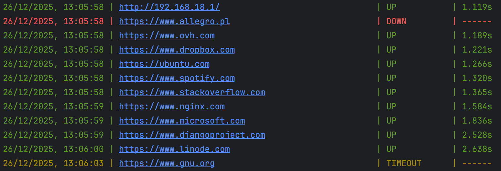

# Uptime Scheduler – website availability monitor
<hr>

## Used technologies


## How to install

1. Clone repository
```sh
git clone https://github.com/N3nT/Uptime-Scheduler
```

2. Install dependencies
```sh
pip install -r requirements.txt
```

3. Run script

>With default config file path, and default logs file path
```sh
python script.py
```

>To set yours own paths, use additional parameters
```sh
python script.py path_to_config path_to_logs
```

*Example*
```sh
python scirpt.py ./config/config.json ./logs/logs.txt
```

## Requirements
- [*aiohttp*](https://asd.pl) - library handling queries to WWW servers
- [*colorama*](https://adsd.pl) - library allowing colourful writing in the console

## About config file

**Example config file**
```json
{
  "urls": ["https://www.bartoszwidlak.it"],
  "timeout": 5,
  "interval": 5,
  "should_save_to_file": true,
  "should_print_to_console": true,
  "schedule": {
      "0": ["https://www.monday.com"],
      "1": ["https://www.tuesday.com"],
      "2": ["https://www.wednesday.com"],
      "3": ["https://www.thursday.com"],
      "4": ["https://www.friday.com"],
      "5": ["https://www.saturday.com"],
      "6": ["https://www.sunday.com"]
  }
}
```

*Config file is neccesary to run script!*

Everyone field in config is optional, if a field is missing or wrong type, the script will use the default value.

**Default values**:
1. "urls" -> []
2. "timeout" -> 5
3. "interval" -> 5
4. "should_save_to_file" -> true
5. "should_write_on_console" -> true
6. "schedule" -> {}
7. Each day is empty list by default

**The order does not matter.**

## Example output

>Console


>Log file


## Problems
Czesc stron (np. https://oracle.com, https://www.amazon.pl) potrafia rzucic status 403 - forbiden lub 503 - service unaviable mimo ze w przegladarce jestesmy w stanie poprawnie wlaczyc dana strone
## Ograniczenia

## Potencjalne ulepszenia


Author: Bartosz Widlak <br>
[GitHub](https://github.com/N3nT) <br> 
[WWW](https://bartoszwidlak.it/) 


<hr>